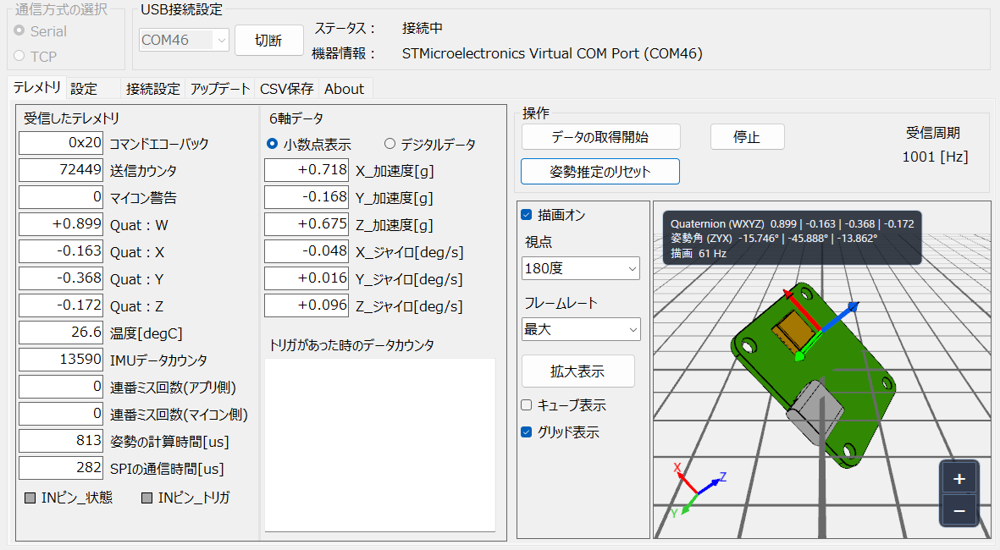

# TR-IMU2-Monitor

TR-IMU2-Monitor は、Techno Road 製 IMU プラットフォーム基板の状態確認、設定変更、姿勢表示、CSV記録、ファームウェア更新を行う Windows デスクトップアプリです。

USBシリアルまたはTCPで基板に接続し、IMUの姿勢やセンサ値を画面上で確認できます。3D表示、CSV保存、基板設定、DFU書き込みまでを1つのツールで扱えます。

## 画面イメージ



---

## 最新リリース

最新版は [Latest Release](https://github.com/technoroad/TR-IMU2-Monitor/releases/latest) からダウンロードできます。

## 主な機能

- USBシリアル / TCP による接続
- 弊社販売の `TR-IMU16607` および `TR-IMU-Platform2` 基板に対応
- 3D姿勢表示
- 基板設定の読み出し、保存、初期化
- クォータニオンまたはEuler角形式でのCSV記録
- `STM32_Programmer_CLI.exe` を使用したDFUファームウェア書き込み

## 対応環境

- Windows11
- [STM32CubeProgrammer](https://www.st.com/ja/development-tools/stm32cubeprog.html)
  - ファームウェア更新機能を使用する場合に必要です。
  - これがインストールされていなくても、本アプリの動作に問題はありません。

## 開発環境
- Visual Studio（.NET Framework 4.7.2対応）

## 実行

`TR-IMU2-Monitor.exe` を起動してください。

## ファームウェア更新

DFU書き込みには [STM32CubeProgrammer](https://www.st.com/ja/development-tools/stm32cubeprog.html) に含まれる `STM32_Programmer_CLI.exe` を使用します。
ファームウェアの更新を行う場合のみインストールする必要があります。

アプリ上でCLIパスとファームウェアファイルを指定して書き込みを実行します。対応するファームウェア形式は `.hex` と `.bin` です。

## ディレクトリ構成

```text
TR-IMU2-Monitor.sln
TR-IMU2-Monitor/
  Form1.cs        メイン画面
  Forms/          補助フォーム
  Helix/          3D表示
  Models/         データモデル
  Services/       通信、パケット、コマンド処理
  Tcp/            TCP通信
  Udp/            UDP通信
  Cli/            外部CLI実行
  Helper/         補助処理
  3d/             3Dモデル
  Picture/        画像リソース
```

## 補足

- アプリ設定は実行ファイルと同じフォルダの `appsettings.xml` に保存されます。
- CSVの保存先やTCP接続先はアプリ上で設定できます。

## ライセンス

このプロジェクトの弊社作成部分は [MIT License](LICENSE) の下で公開されています。
第三者ソフトウェアのライセンスについては [THIRD-PARTY-NOTICES.txt](THIRD-PARTY-NOTICES.txt) を参照してください。
